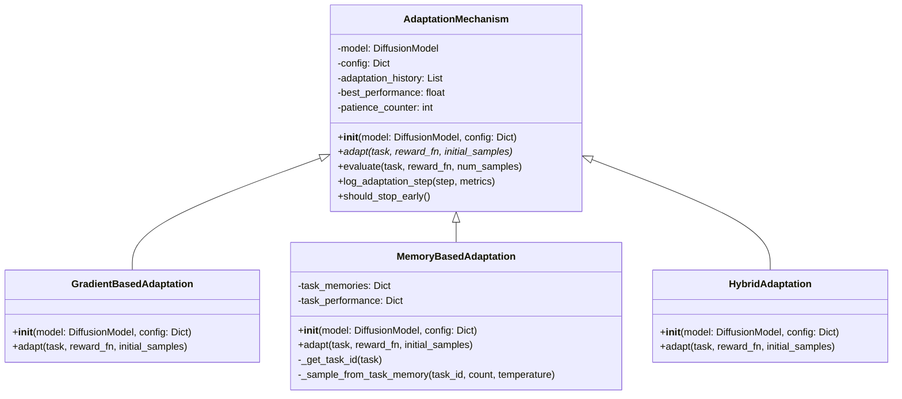
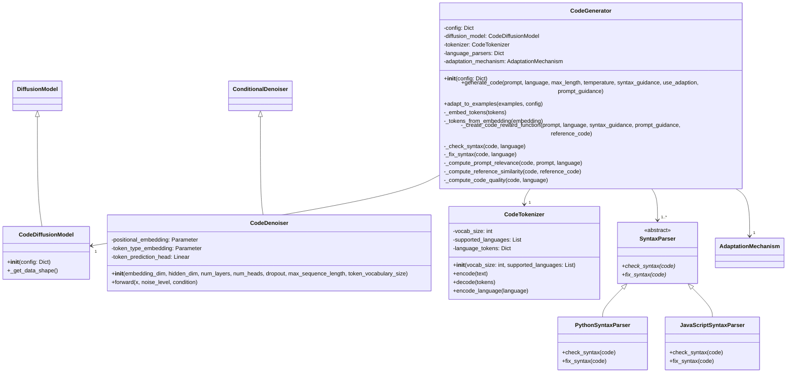
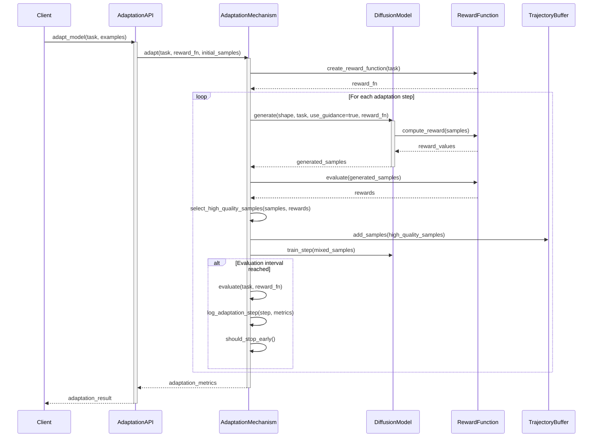
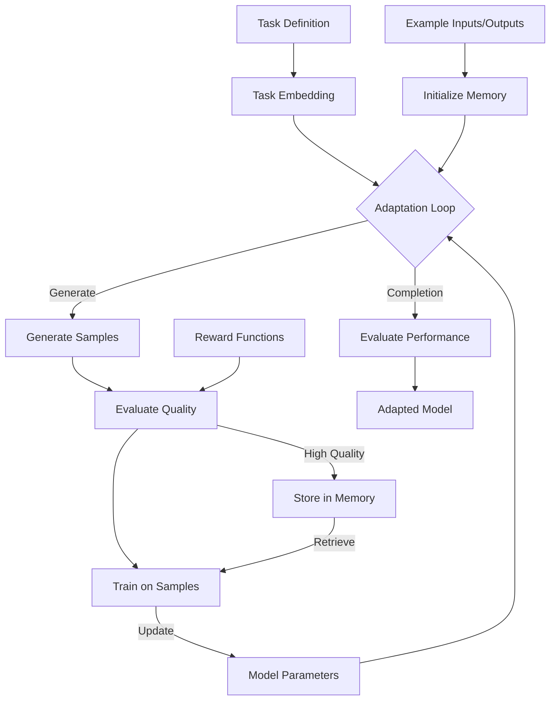

# Agentic Diffusion Detailed Architecture Design

This document outlines the detailed architectural design for the Agentic Diffusion system based on AdaptDiffuser. It provides comprehensive diagrams, interfaces, and implementation guidelines to support code generation capabilities, self-optimization mechanisms, extensibility, and testing.

## Table of Contents

1. [System Overview](#1-system-overview)
2. [Component Architecture](#2-component-architecture)
3. [Class Diagrams](#3-class-diagrams)
4. [Sequence Diagrams](#4-sequence-diagrams)
5. [Data Flow Diagrams](#5-data-flow-diagrams)
6. [API Interfaces](#6-api-interfaces)
7. [Directory Structure](#7-directory-structure)
8. [Deployment Considerations](#8-deployment-considerations)
9. [Testing Architecture](#9-testing-architecture)

## 1. System Overview

The Agentic Diffusion system is an advanced diffusion-based generative framework that enables code generation and agentic planning through self-evolving models. The core capabilities include:

- **Diffusion-based Generation**: Using denoising diffusion probabilistic models as the core generative mechanism
- **Self-Optimization**: Recursive improvement through reward-guided generation and adaptation
- **Code Generation**: Specialized diffusion models for syntax-aware code generation
- **Multi-Domain Support**: Extensible architecture supporting multiple domains and models

The system achieves algorithmic coherence by maintaining consistent patterns and representations across components, with modular boundaries that allow for extensibility.

## 2. Component Architecture

### 2.1 High-Level Component Diagram

```mermaid
graph TD
    subgraph Applications
        CodeGen[Code Generation Application]
        PlanGen[Planning Application]
        CustomApp[Custom Applications]
    end

    subgraph CoreAPIs
        GenAPI[Generation API]
        AdaptAPI[Adaptation API]
        ControlAPI[Control API]
    end

    subgraph DiffusionEngine
        ModelCore[Model Core]
        AdaptMech[Adaptation Mechanisms]
        Rewards[Reward Functions]
        TrajBuffer[Trajectory Buffers]
    end

    subgraph DomainModules
        CodeModule[Code Generation Module]
        PlanModule[Planning Module]
        ExtModule[Extension Modules]
    end

    subgraph Infrastructure
        UVPackage[UV Package Manager]
        Training[Training Pipeline]
        Deploy[Deployment Tools]
        Testing[Testing Framework]
    end

    %% Connections between components
    Applications --> CoreAPIs
    CoreAPIs --> DiffusionEngine
    DiffusionEngine --> DomainModules
    DomainModules --> DiffusionEngine
    CoreAPIs --> DomainModules
    DiffusionEngine --> Infrastructure
    DomainModules --> Infrastructure

### 2.2 Module Responsibilities

#### 2.2.1 Diffusion Engine Core

The central component that implements diffusion-based generative processes.

- **Model Core**: Implements the diffusion model architecture and processes
- **Adaptation Mechanisms**: Enables model adaptation to new tasks and domains
- **Reward Functions**: Provides guidance for generation through reward signals
- **Trajectory Buffers**: Maintains high-quality solutions for ongoing improvement

#### 2.2.2 Domain Modules

Specialized components for specific applications.

- **Code Generation Module**: Specialized components for code generation
- **Planning Module**: Components for trajectory planning and agent behaviors
- **Extension Modules**: Framework for custom domain extensions

#### 2.2.3 Core APIs

Public interfaces for system interaction.

- **Generation API**: Interfaces for content generation
- **Adaptation API**: Interfaces for model adaptation
- **Control API**: Interfaces for system configuration and management

#### 2.2.4 Infrastructure

Supporting components for development and deployment.

- **UV Package Manager**: Manages package dependencies
- **Training Pipeline**: Infrastructure for model training
- **Deployment Tools**: Utilities for model deployment
- **Testing Framework**: Components for comprehensive testing

### 2.3 Component Interaction Diagram

```mermaid
flowchart TD
    subgraph Client
        UserApp[User Application]
    end

    subgraph API
        GenAPI[Generation API]
        AdaptAPI[Adaptation API]
    end

    subgraph Core
        DiffModel[Diffusion Model]
        Adaptation[Adaptation Mechanism]
        Reward[Reward Functions]
        Memory[Trajectory Buffer]
    end

    subgraph Domain
        CodeGen[Code Generator]
        SyntaxVal[Syntax Validator]
        TaskEmbed[Task Embedding]
    end

    subgraph Infrastructure
        Testing[Testing Framework]
        Packaging[UV Package Manager]
        Deployment[Deployment Tools]
    end

    %% Interactions
    UserApp -->|Request| GenAPI
    UserApp -->|Configure| AdaptAPI
    
    GenAPI -->|Generate| DiffModel
    GenAPI -->|Domain Setup| Domain
    
    AdaptAPI -->|Optimize| Adaptation
    AdaptAPI -->|Task Definition| TaskEmbed
    
    DiffModel -->|Store Quality Examples| Memory
    DiffModel <-->|Quality Feedback| Reward
    DiffModel <-->|Adapt| Adaptation
## 3. Class Diagrams

### 3.1 Diffusion Model Core

```mermaid
classDiagram
    class DiffusionModel {
        -config: Dict
        -model_type: String
        -num_diffusion_steps: int
        -device: String
        -precision: String
        -noise_schedule: NoiseSchedule
        -denoiser: DenoiserNetwork
        -optimizer: Optimizer
        -lr_scheduler: LRScheduler
        -training_step: int
        -adaptation_step: int
        -trajectory_buffer: TrajectoryBuffer
        -adaptation_hooks: List
        +__init__(config: Dict)
        +setup_training(optimizer_config: Dict)
        +forward_diffusion(x_0, noise_level)
        +single_denoising_step(x_t, t, condition)
        +generate(shape, condition, use_guidance, guidance_scale, reward_fn)
        +train_step(x_0, condition)
        +training_loop(dataloader, num_epochs, condition_fn, eval_fn)
        +adapt(task, num_steps, reward_fn, adaptation_config)
        +register_adaptation_hook(hook)
        +get_state_dict()
        +load_state_dict(state_dict)
    }

    class NoiseSchedule {
        <<abstract>>
        -num_steps: int
        +__init__(num_steps: int)
        +get_noise_level(timestep)* 
    }

    class LinearNoiseSchedule {
        -beta_start: float
        -beta_end: float
        -betas: Tensor
        -alphas: Tensor
        -alphas_cumprod: Tensor
        -sqrt_alphas_cumprod: Tensor
        -sqrt_one_minus_alphas_cumprod: Tensor
        +__init__(num_steps, beta_start, beta_end)
        +get_noise_level(timestep)
    }

    class CosineNoiseSchedule {
        -s: float
        -alphas_cumprod: Tensor
        -sqrt_alphas_cumprod: Tensor
        -sqrt_one_minus_alphas_cumprod: Tensor
        +__init__(num_steps, s)
        +get_noise_level(timestep)
    }

    class DenoiserNetwork {
        <<abstract>>
        #embedding_dim: int
        #hidden_dim: int
        #num_layers: int
        #num_heads: int
        #dropout: float
        +__init__(embedding_dim, hidden_dim, num_layers, num_heads, dropout)
        +forward(x, noise_level, condition)* 
    }

    class ConditionalDenoiser {
        -noise_embedding: Module
        -condition_embedding: Module
        -cross_attention: ModuleList
        -self_attention: ModuleList
        -input_proj: Linear
        -output_proj: Linear
        +__init__(embedding_dim, hidden_dim, num_layers, num_heads, dropout)
        +forward(x, noise_level, condition)
    }

    class UnconditionalDenoiser {
        -noise_embedding: Module
        -encoder: ModuleList
        -input_proj: Linear
        -output_proj: Linear
        +__init__(embedding_dim, hidden_dim, num_layers, num_heads, dropout)
        +forward(x, noise_level, condition)
    }

    class TrajectoryBuffer {
        -capacity: int
        -trajectories: List
        -rewards: List
        -priorities: List
        +__init__(capacity: int)
        +add(trajectory, reward)
        +sample(batch_size)
        +size()
    }

    DiffusionModel --> "1" NoiseSchedule
    DiffusionModel --> "1" DenoiserNetwork
    DiffusionModel --> "1" TrajectoryBuffer
    
    NoiseSchedule <|-- LinearNoiseSchedule
    NoiseSchedule <|-- CosineNoiseSchedule
    NoiseSchedule <|-- CustomNoiseSchedule
    
    DenoiserNetwork <|-- ConditionalDenoiser
    DenoiserNetwork <|-- UnconditionalDenoiser
```

### 3.2 Adaptation Mechanism Classes



### 3.3 Code Generator Classes



### 3.4 Testing Framework Classes

```mermaid
classDiagram
    class TestManager {
        -config: Dict
        -test_suites: Dict
        -coverage_data: Dict
        -test_results: Dict
        +__init__(config: Dict)
        +discover_tests(directory)
        +run_tests(test_types, parallel)
        +check_coverage_target()
        +generate_coverage_report(output_format)
        +find_untested_code()
        +suggest_test_improvements()
        -_parse_test_output(stdout, stderr)
        -_parse_coverage_data()
    }

    class TestGenerator {
        -config: Dict
        -source_files: Dict
        -test_files: Dict
        -function_map: Dict
## 4. Sequence Diagrams

### 4.1 Code Generation Process

```mermaid
sequenceDiagram
    participant Client
    participant CG as CodeGenerator
    participant DM as CodeDiffusionModel
    participant TK as CodeTokenizer
    participant SP as SyntaxParser
    participant RW as RewardFunction

    Client->>CG: generate_code(prompt, language)
    activate CG
    
    CG->>TK: encode(prompt)
    TK-->>CG: prompt_tokens
    
    CG->>TK: encode_language(language)
    TK-->>CG: language_token
    
    CG->>CG: _embed_tokens([language_token, prompt_tokens])
    CG->>CG: _create_code_reward_function(prompt, language)
    
    CG->>DM: generate(shape, condition, use_guidance, reward_fn)
    activate DM
    
    loop For each diffusion step
        DM->>DM: single_denoising_step()
        DM->>RW: compute_reward(current_state)
        RW-->>DM: reward_gradient
    end
    
    DM-->>CG: code_embedding, trajectory
    deactivate DM
    
    CG->>CG: _tokens_from_embedding(code_embedding)
    CG->>TK: decode(code_tokens)
    TK-->>CG: generated_code
    
    CG->>SP: check_syntax(generated_code)
    SP-->>CG: syntax_score
    
    alt syntax_guidance enabled
        CG->>SP: fix_syntax(generated_code)
        SP-->>CG: fixed_code
    end
    
    CG-->>Client: generated_code, metadata
    deactivate CG
```

### 4.2 Model Adaptation Process



### 4.3 Testing and Coverage Analysis

```mermaid
sequenceDiagram
    participant Dev as Developer
    participant TM as TestManager
    participant TG as TestGenerator
    participant PT as PyTest

    Dev->>TM: run_tests()
    activate TM
    
    TM->>TM: discover_tests()
    
    loop For each test type
        TM->>PT: execute_tests(test_type)
        PT-->>TM: test_results
    end
    
    TM->>TM: _parse_coverage_data()
    
    TM->>TM: check_coverage_target()
    
## 5. Data Flow Diagrams

### 5.1 Core Generation Data Flow

```mermaid
flowchart TD
    Input[Input Prompt/Task] --> Preprocess[Preprocess Input]
    Preprocess --> Embedding[Create Embedding]
    Embedding --> Noise[Add Noise for Diffusion]
    
    Noise --> DenoisingLoop{Denoising Loop}
    DenoisingLoop --> |Next Step| DenoisingLoop
    DenoisingLoop --> |Complete| RawOutput[Raw Output]
    
    RewardFn[Reward Function] --> |Guide| DenoisingLoop
    TaskContext[Task Context] --> |Condition| DenoisingLoop
    ModelParams[Model Parameters] --> DenoisingLoop
    
    RawOutput --> PostProcess[Post-process Output]
    PostProcess --> Validate[Validate Output]
    Validate --> FinalOutput[Final Output]
    
    Validate --> |Store High Quality| MemoryBuffer[Memory Buffer]
    MemoryBuffer --> |Retrieve Examples| DenoisingLoop
```

### 5.2 Adaptation Data Flow



### 5.3 Code Generation Data Flow

```mermaid
flowchart TD
    CodePrompt[Code Prompt] --> Tokenize[Tokenize Input]
    LangSpec[Language Specification] --> Tokenize
    
    Tokenize --> Embedding[Create Embeddings]
    Embedding --> DiffusionGen[Diffusion Generation]
    
    SyntaxRules[Syntax Rules] --> |Guide| DiffusionGen
    RewardFn[Code Quality Reward] --> |Guide| DiffusionGen
    
    DiffusionGen --> CodeTokens[Code Tokens]
    CodeTokens --> Decode[Decode Tokens]
    
    Decode --> RawCode[Raw Generated Code]
    RawCode --> SyntaxCheck[Syntax Checking]
    
    SyntaxCheck --> |Errors| SyntaxFix[Fix Syntax]
    SyntaxFix --> FormattedCode[Formatted Code]
    
    SyntaxCheck --> |No Errors| FormattedCode
    FormattedCode --> QualityEval[Quality Evaluation]
    
## 6. API Interfaces

### 6.1 Generation API

```python
class GenerationAPI:
    """Public API for diffusion-based generation"""
    
    def __init__(self, config):
        """
        Initialize the generation API
        
        Args:
            config: Configuration dictionary
        """
        pass
    
    def create_model(self, model_type, model_config):
        """
        Create a new diffusion model
        
        Args:
            model_type: Type of model to create
            model_config: Model configuration
            
        Returns:
            model_id: Identifier for the created model
        """
        pass
    
    def generate(self, model_id, params, guidance=None):
        """
        Generate content using the specified model
        
        Args:
            model_id: Model identifier
            params: Generation parameters
            guidance: Optional guidance configuration
            
        Returns:
            result: Generated content
            metadata: Generation metadata
        """
        pass
    
    def batch_generate(self, model_id, batch_params, guidance=None):
        """
        Generate content in batch mode
        
        Args:
            model_id: Model identifier
            batch_params: List of generation parameters
            guidance: Optional guidance configuration
            
        Returns:
            results: List of generated content
            metadata: Batch generation metadata
        """
        pass
    
    def get_model_info(self, model_id):
        """
        Get information about a model
        
        Args:
            model_id: Model identifier
            
        Returns:
            model_info: Model information
        """
        pass
```

### 6.2 Adaptation API

```python
class AdaptationAPI:
    """Public API for model adaptation"""
    
    def __init__(self, config):
        """
        Initialize the adaptation API
        
        Args:
            config: Configuration dictionary
        """
        pass
    
    def define_task(self, task_description, examples=None):
        """
        Define a new task for adaptation
        
        Args:
            task_description: Description of the task
            examples: Optional examples for the task
            
        Returns:
            task_id: Identifier for the task
        """
        pass
    
    def adapt_model(self, model_id, task_id, adaptation_config=None):
        """
        Adapt a model to a task
        
        Args:
            model_id: Model identifier
            task_id: Task identifier
            adaptation_config: Optional adaptation configuration
            
        Returns:
            adaptation_id: Identifier for the adaptation process
        """
        pass
    
    def get_adaptation_status(self, adaptation_id):
        """
        Get status of an adaptation process
        
        Args:
            adaptation_id: Adaptation process identifier
            
        Returns:
            status: Status information
        """
        pass
    
    def evaluate_adaptation(self, model_id, task_id):
        """
        Evaluate a model's performance on a task
        
        Args:
            model_id: Model identifier
            task_id: Task identifier
            
        Returns:
            evaluation: Evaluation results
        """
        pass
```

### 6.3 Code Generation API

```python
class CodeGenerationAPI:
    """Public API for code generation"""
    
    def __init__(self, config):
        """
        Initialize the code generation API
        
        Args:
            config: Configuration dictionary
        """
        pass
    
    def generate_code(self, prompt, language, params=None):
        """
        Generate code from a prompt
        
        Args:
            prompt: Natural language prompt
            language: Target programming language
            params: Optional generation parameters
            
        Returns:
            code: Generated code
            metadata: Generation metadata
        """
        pass
    
    def improve_code(self, code, feedback, language):
        """
        Improve existing code based on feedback
        
        Args:
            code: Existing code
            feedback: Feedback for improvement
            language: Programming language
            
        Returns:
            improved_code: Improved code
            diff: Difference between original and improved code
        """
        pass
    
    def add_examples(self, examples):
        """
        Add examples to improve code generation
        
        Args:
            examples: List of (prompt, code, language) tuples
            
        Returns:
            success: Whether examples were added successfully
        """
        pass
    
    def supported_languages(self):
        """
        Get list of supported programming languages
        
        Returns:
            languages: List of supported languages
        """
        pass
```

### 6.4 Testing API

```python
class TestingAPI:
    """Public API for testing and coverage analysis"""
    
    def __init__(self, config):
        """
        Initialize the testing API
        
        Args:
            config: Configuration dictionary
        """
        pass
    
    def run_tests(self, test_types=None, coverage=True):
        """
        Run tests and collect coverage data
        
        Args:
            test_types: Optional list of test types to run
            coverage: Whether to collect coverage data
            
        Returns:
            results: Test results
            coverage_data: Coverage data if requested
        """
        pass
    
    def check_coverage(self, target=0.9):
        """
        Check if code coverage meets target
        
        Args:
            target: Target coverage percentage
            
        Returns:
            result: Coverage check result
        """
        pass
    
## 7. Directory Structure

```
agentic_diffusion/
├── core/
│   ├── __init__.py
│   ├── diffusion_model.py       # Core diffusion model implementation
│   ├── noise_schedules.py       # Noise schedule implementations
│   ├── denoiser_networks.py     # Neural network denoisers
│   ├── trajectory_buffer.py     # Memory buffer for trajectories
│   └── reward_functions.py      # Reward function base classes
│
├── adaptation/
│   ├── __init__.py
│   ├── adaptation_mechanism.py  # Base adaptation mechanism
│   ├── gradient_adaptation.py   # Gradient-based adaptation
│   ├── memory_adaptation.py     # Memory-based adaptation
│   ├── hybrid_adaptation.py     # Combined adaptation approaches
│   └── task_embeddings.py       # Task representation utilities
│
├── code_generation/
│   ├── __init__.py
│   ├── code_generator.py        # Main code generator
│   ├── code_diffusion.py        # Code-specific diffusion model
│   ├── code_tokenizer.py        # Code tokenization utilities
│   ├── syntax_parsers/          # Language-specific syntax parsers
│   │   ├── __init__.py
│   │   ├── base_parser.py
│   │   ├── python_parser.py
│   │   ├── javascript_parser.py
│   │   ├── java_parser.py
│   │   └── go_parser.py
│   └── rewards/                 # Code-specific reward functions
│       ├── __init__.py
│       ├── syntax_reward.py
│       ├── relevance_reward.py
│       └── quality_reward.py
│
├── planning/
│   ├── __init__.py
│   ├── planning_diffusion.py    # Planning-specific diffusion model
│   ├── state_representations.py # State representation utilities
│   ├── action_space.py          # Action space definitions
│   └── plan_validator.py        # Plan validation utilities
│
├── api/
│   ├── __init__.py
│   ├── generation_api.py        # Generation API
│   ├── adaptation_api.py        # Adaptation API
│   ├── code_generation_api.py   # Code generation API
│   └── control_api.py           # System control API
│
├── infrastructure/
│   ├── __init__.py
│   ├── uv_manager.py            # UV package management utilities
│   ├── training_pipeline.py     # Training infrastructure
│   ├── deployment.py            # Deployment utilities
│   └── monitoring.py            # Monitoring and logging
│
├── testing/
│   ├── __init__.py
│   ├── test_manager.py          # Test execution and management
│   ├── test_generator.py        # Test stub generation
│   ├── coverage_utils.py        # Coverage analysis utilities
│   └── fixtures/                # Common test fixtures
│       ├── __init__.py
│       ├── model_fixtures.py
│       └── data_fixtures.py
│
├── examples/
│   ├── __init__.py
│   ├── code_generation/         # Code generation examples
│   ├── adaptation/              # Adaptation examples
│   └── testing/                 # Testing framework examples
│
└── tests/
    ├── unit/                    # Unit tests
    │   ├── core/                
    │   ├── adaptation/          
    │   ├── code_generation/     
    │   └── infrastructure/      
    ├── integration/             # Integration tests
    │   ├── api/                 
    │   ├── code_generation/     
    │   └── adaptation/          
    └── system/                  # System tests
        ├── end_to_end/          
        └── performance/         
```

## 8. Deployment Considerations

### 8.1 Hardware Requirements

The Agentic Diffusion system has varying hardware requirements depending on the deployment scenario:

1. **Development Environment**
   - Minimum: 4-core CPU, 16GB RAM, GPU with 8GB VRAM (for model training)
   - Recommended: 8-core CPU, 32GB RAM, GPU with 16GB+ VRAM

2. **Testing Environment**
   - Similar to development environment but with additional CI/CD infrastructure
   - Dedicated storage for test artifacts and coverage reports

3. **Production Environment**
   - CPU-only inference: 16-core CPU, 64GB RAM minimum
   - GPU inference: NVIDIA T4, A10G, or better GPUs
   - Distributed deployment: Multiple nodes with load balancing

### 8.2 Scalability Strategies

The architecture supports multiple scalability strategies:

1. **Vertical Scaling**
   - Optimize for multi-GPU training and inference
   - Implement mixed precision operations (FP16/BF16)
   - Enable model quantization for efficient inference

2. **Horizontal Scaling**
   - Stateless API layer for horizontal scaling
   - Model serving across multiple nodes
   - Distributed training across multiple machines

3. **Component-Level Scaling**
   - Independent scaling of API layer, model serving, and infrastructure
   - Separate resource allocation for different domain modules
   - Decoupled training and inference environments

### 8.3 Containerization and Orchestration

1. **Container Strategy**
   - Base image with Python 3.8+ and CUDA dependencies
   - Separate containers for API, model serving, and infrastructure
   - UV package management for reproducible environments

2. **Orchestration**
   - Kubernetes for production deployments
   - Helm charts for component deployment
   - Infrastructure as Code (IaC) for environment setup

3. **CI/CD Integration**
   - Automated testing and coverage analysis
   - Model versioning and artifact management
   - Blue/green deployment for production updates

### 8.4 Monitoring and Observability

1. **Model Monitoring**
   - Performance metrics: latency, throughput, error rates
   - Resource utilization: CPU, GPU, memory
   - Model drift detection for adaptation quality

2. **Logging Strategy**
   - Structured logging with contextual information
   - Centralized log aggregation
   - Correlation IDs for request tracing

3. **Alerting**
   - Threshold-based alerts for performance degradation
   - Anomaly detection for unusual patterns
   - On-call rotation for critical issues

### 8.5 Security Considerations

1. **Model Security**
   - Input validation and sanitization
   - Rate limiting for API endpoints
   - Secure model storage and versioning

2. **Code Generation Safety**
   - Sandboxed code execution
   - Static analysis for security vulnerabilities
   - Permission-based access to code generation features

3. **Data Protection**
   - Encryption of sensitive data
   - Access control for model APIs
   - Compliance with data protection regulations

## 9. Testing Architecture

### 9.1 Testing Strategy

The Agentic Diffusion system implements a comprehensive testing strategy to ensure 90% test coverage:

1. **Testing Layers**
   - Unit tests for individual components
   - Integration tests for component interactions
   - System tests for end-to-end workflows
   - Performance tests for efficiency and scalability

2. **Test Automation**
   - Continuous Integration (CI) pipeline for automated testing
   - Test stub generation for new components
   - Regression test suite for preventing regressions

3. **Coverage Analysis**
   - Line coverage: 90% target across all modules
   - Branch coverage: 85% target for critical modules
   - Function coverage: 95% target for public interfaces

### 9.2 Test Data Management

1. **Test Data Strategy**
   - Synthetic test data generation
   - Versioned test fixtures
   - Parameterized test cases

2. **Mock Objects and Stubs**
   - Mock implementation of external dependencies
   - Stub implementations for internal components
   - Test doubles for complex interactions

### 9.3 Test Execution Environment

1. **Local Testing**
   - Developer workstation testing
   - Pre-commit hooks for basic validation
   - Fast feedback loop for development

2. **CI Testing**
   - Automated test execution on pull requests
   - Scheduled comprehensive test runs
   - Coverage reporting and tracking

3. **Production Validation**
   - Canary testing for production deployments
   - A/B testing for new features
   - Performance monitoring in production
    def generate_test_stubs(self, modules=None):
        """
        Generate test stubs for untested code
        
        Args:
            modules: Optional list of modules to focus on
            
        Returns:
            generated: Information about generated test stubs
        """
        pass
    
    def coverage_report(self, format='html'):
        """
        Generate coverage report
        
        Args:
            format: Report format
            
        Returns:
            report_path: Path to generated report
        """
        pass
```
    QualityEval --> |Store High Quality| CodeExamples[Code Examples Buffer]
    CodeExamples --> |Improve| DiffusionGen
    
    QualityEval --> FinalCode[Final Code]
```
    alt Coverage below target
        TM->>TG: analyze_test_coverage(test_manager)
        TG-->>TM: coverage_gaps
        
        TM->>TG: generate_test_stubs(gaps)
        TG-->>TM: generated_files
        
        TM->>TM: suggest_test_improvements()
    end
    
    TM-->>Dev: test_results, coverage_info
    deactivate TM
```
        +__init__(config: Dict)
        +analyze_source_code(directory)
        +analyze_test_coverage(test_manager)
        +generate_test_stubs(gaps, output_directory)
        -_get_test_file_path(module_name, base_dir)
        -_create_test_file(file_path, module_name, module_info)
        -_generate_pytest_content(module_name, module_info)
        -_generate_unittest_content(module_name, module_info)
    }

    TestManager --> "0..1" TestGenerator : uses
```
    
    CodeGen -->|Generate Code| DiffModel
    CodeGen -->|Validate| SyntaxVal
    
    Adaptation -->|Retrieve Examples| Memory
    Adaptation -->|Task Context| TaskEmbed
    
    Domain -->|Domain-specific Rewards| Reward
    
    Testing -->|Verify| Core
    Testing -->|Validate| Domain
    Packaging -->|Manage Dependencies| Infrastructure
    Deployment -->|Deploy| Core
```
